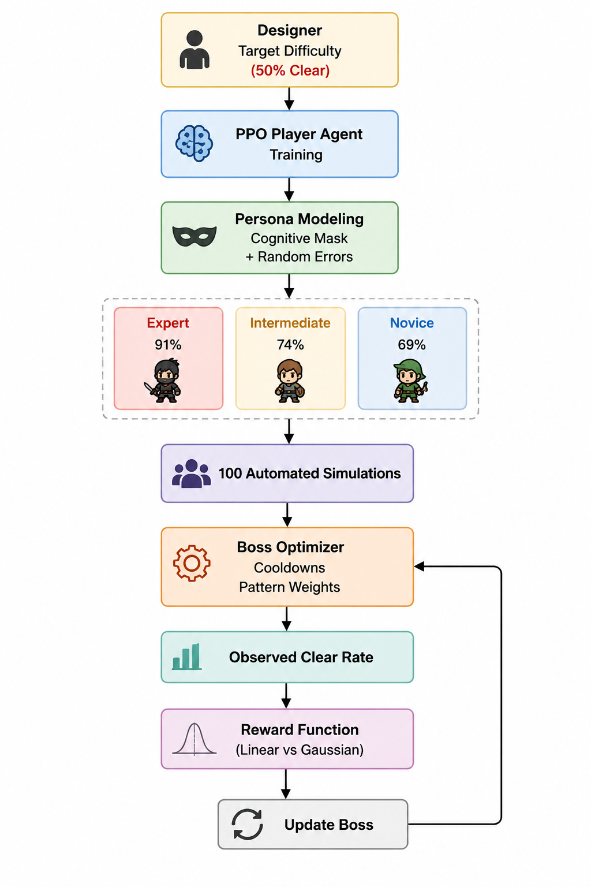
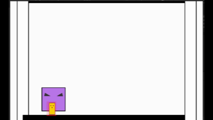
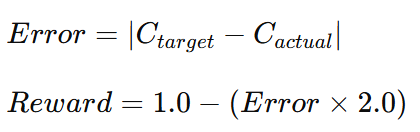
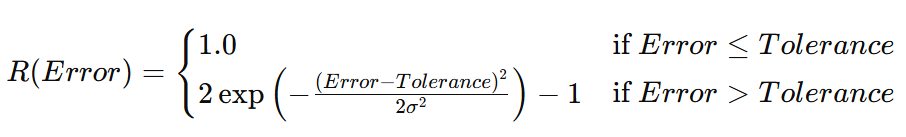

# Adaptive Boss Difficulty Tuning via Reinforcement Learning Personas
### Automated QA Framework for Target Difficulty Tracking in Multi-User Game Environments

---
## Can reinforcement learning reduce the cost of repetitive game QA?
##### This project presents an automated QA framework that tunes boss difficulty toward designer-defined target clear rates using RL-based player personas.

## Results at a Glance

🎯 Target Clear Rate : 50%

✅ Observed Clear Rate : 48%

📉 Absolute Error : 2%

Expert Persona : 91%

Intermediate Persona : 74%

Novice Persona : 69%

---

## TL;DR

* Built an automated QA framework that tunes boss difficulty toward a designer-defined target clear rate.
* Trained reinforcement learning player agents using PPO in Unity ML-Agents.
* Generated human-like personas with different skill levels through cognitive masking and stochastic execution errors.
* Compared linear and Gaussian reward formulations for boss optimization.
* Achieved a **48% clear rate against a target difficulty of 50%**, resulting in only **2% absolute error**.

---

## Problem

Existing balancing workflows heavily rely on repeated manual playtesting, making it difficult to efficiently achieve designer-intended difficulty targets.

Designers typically adjust boss parameters manually, conduct repeated playtests, collect clear rates, and iterate until the intended difficulty is achieved.

This process becomes increasingly costly in multiplayer environments where player skill distributions vary significantly.

This project proposes an automated QA framework that leverages reinforcement learning personas to tune boss parameters toward a designer-intended target clear rate.

---

## System Overview

---

## Persona Generation

A player agent was first trained using PPO to evade predefined boss attack patterns.

To simulate realistic player populations, additional constraints were introduced:

* Cognitive masking
* Probabilistic execution mistakes

These mechanisms generated multiple personas with different skill levels.

### Persona Performance

| Persona      | Expected Avoidance Rate |
| ------------ | ----------------------: |
| Expert       |                     91% |
| Intermediate |                     74% |
| Novice       |                     69% |

Unlike conventional evaluations that rely on a single expert agent, the proposed framework models heterogeneous player populations observed in live game environments.

---

## Boss Optimization
The boss did not learn entirely new behaviors.
Instead, it optimized existing design parameters including pattern cooldowns and selection weights to achieve target clear rates.

The boss agent was trained to automatically adjust its parameters in order to achieve a designer-specified target difficulty.

Optimizable parameters included:

* Boss pattern cooldowns
* Boss pattern selection weights

For each optimization step:

1. Personas with randomized DPS values participated in battle simulations.
2. 100 automated encounters were executed.
3. The observed clear rate was compared against the target difficulty.
4. Rewards were assigned based on the difference.
5. Boss parameters were updated accordingly.

---

## Reward Function Comparison

Two reward formulations were investigated to optimize boss parameters toward the designer-defined target difficulty.

### Linear Reward

The linear reward formulation penalized the boss proportionally to the absolute difference between the observed and target clear rates.

  

This formulation continuously encouraged parameter updates regardless of how close the observed clear rate was to the target. As a result, even small deviations around the desired difficulty generated corrective pressure.

**Result:**

- Persistent oscillations around the target difficulty.
- Unstable convergence behavior during optimization.
- Difficulty maintaining a designer-acceptable difficulty range.

---

### Tolerance-Aware Gaussian Reward

To address the oscillatory behavior of the linear formulation, a tolerance-aware Gaussian reward model was introduced.

  

Unlike the linear reward, this formulation explicitly incorporated the concept of an acceptable difficulty range.

When the observed clear rate fell within the predefined tolerance threshold, the boss received the maximum reward without additional pressure to update its parameters. Outside the tolerance region, Gaussian penalties encouraged corrective adjustments that became increasingly stronger as the deviation grew.

This design reflects practical game balancing requirements, where achieving an exact clear rate is less important than maintaining difficulty within a designer-acceptable range.

**Result:**

- Reduced oscillatory updates near the target difficulty.
- Improved optimization stability.
- More accurate target difficulty tracking.
- Better alignment with real-world game design practices.

---

## Final Evaluation

After optimization, 40 candidate boss configurations were evaluated.

The configuration closest to the intended difficulty was selected and tested against a population of 100 persona agents.

### Results

| Metric              | Value |
| ------------------- | ----: |
| Target Clear Rate   |   50% |
| Observed Clear Rate |   48% |
| Absolute Error      |    2% |

The proposed framework successfully reproduced the designer-intended difficulty with high accuracy.

---

## Technical Stack

* Unity (2D)
* Unity ML-Agents
* PPO (Proximal Policy Optimization)
* C#
* Automated Simulation Pipeline
* Unity Console Log-based Evaluation

---

## Key Contributions

* Proposed an automated QA framework for boss difficulty tuning.
* Introduced realistic player personas using cognitive masking and stochastic execution errors.
* Compared reward formulations for target difficulty tracking.
* Demonstrated accurate difficulty reproduction within a 2% error margin.
* Reduced reliance on repetitive manual playtesting.

---

## Future Work

Potential extensions include:

* PyTorch-based custom PPO implementations
* Self-play based adaptive boss strategies
* Multi-agent cooperation scenarios
* Dynamic difficulty adaptation during live gameplay
